# EMR Monitoring

[](https://packagist.org/packages/himedia/emr-monitoring)

Command line tool for monitoring Amazon Elastic MapReduce ([Amazon EMR](http://aws.amazon.com/elasticmapreduce/)) jobflows
and analyze past jobflows.

## Table of Contents

  * [Overview](#overview)
  * [Description](#description)
    * [Retrieve information from many places](#retrieve-information-from-many-places)
    * [All that information is gathered in one screen](#all-that-information-is-gathered-in-one-screen)
    * [Task timeline](#task-timeline)
  * [Installing](#installing)
    * [Git clone](#git-clone)
    * [Configuration](#configuration)
    * [Dependencies](#dependencies)
  * [Usage](#usage)
    * [Command line options](#command-line-options)
    * [With a finished jobflow](#with-a-finished-jobflow)
    * [With a new jobflow](#with-a-new-jobflow)
  * [Documentation](#documentation)
  * [Copyrights & licensing](#copyrights--licensing)
  * [ChangeLog](#changelog)
  * [Git branching model](#git-branching-model)

## Overview

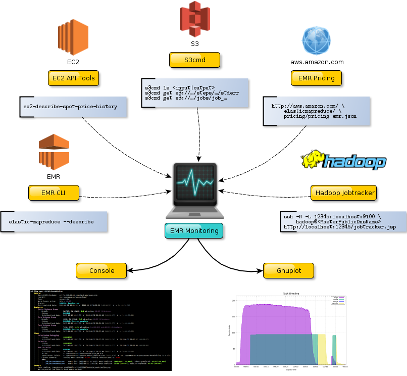

## Description

### Retrieve information from many places

  1. Amazon EMR via [Amazon Elastic MapReduce Ruby Client](http://aws.amazon.com/developertools/2264) to get description of a jobflow:

    ```bash
$ elastic-mapreduce --describe <jobflowid>…
    ```

  2. Amazon EC2 via [Amazon EC2 API Tools](http://aws.amazon.com/developertools/351)
  to retrieve history of spots instances price:

    ```bash
$ ec2-describe-spot-price-history …
    ```

  3. Amazon S3 via [S3cmd](http://s3tools.org/s3cmd) to get size of both input and output files, to retrieve potential
  errors and to get log summary:

    ```bash
$ s3cmd ls <input|output>
$ s3cmd get s3://…/steps/…/stderr
$ s3cmd get s3://…/jobs/job_…
    ```

  4. Amazon Elastic MapReduce Pricing of On-Demand instances via this [URL](http://aws.amazon.com/elasticmapreduce/pricing/)
  and its underlying [JSON service](http://aws.amazon.com/elasticmapreduce/pricing/pricing-emr.json).

  5. [Hadoop JobTracker](http://docs.aws.amazon.com/ElasticMapReduce/latest/DeveloperGuide/emr-manage-view-web-interfaces.html)
  running on the master node and accessed by an automatic SSH tunnel:

    ```bash
$ ssh -N -L 12345:localhost:9100 hadoop@<MasterPublicDnsName> …
$ wget http://localhost:12345/jobtracker.jsp
    ```

  6. Additionally, **EMR Monitoring** computes elapsed times between various events
  and realizes an estimation of the jobflow's total cost.

### All that information is gathered in one screen

An *animation* is better than a thousand words:

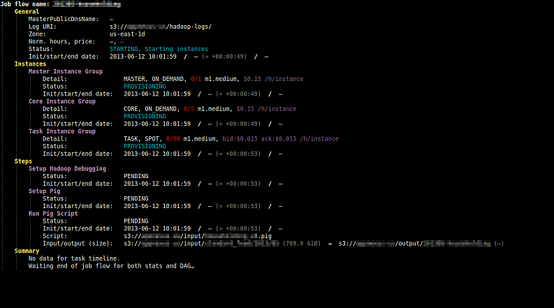

Result with a completed jobflow *(click for full resolution image)*:

[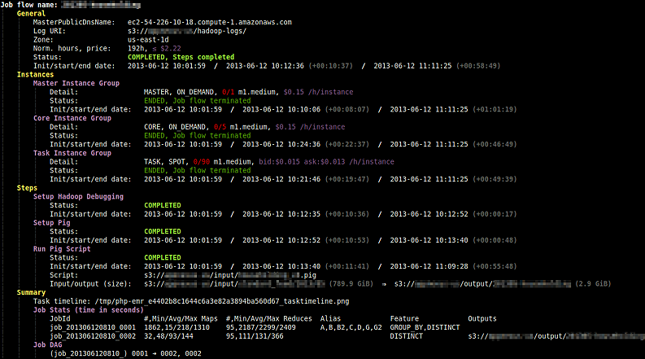](doc/images/completed-jobflow.png)

#### Some clarifications

##### Price

  * The ask price for spot instances comes in real time from EC2 API Tools.
  * The total price in general section is the sum of the prices of each instance group,
  *i.e.* for each group: `<instance-price> × <number-of-instances> × ceil(<number-of-hours>)`.

##### Elapsed times

  * Elapsed times in gray measure the time elapsed between initialization and start date of instance/step,
  and between start date and end date of instance/step.
  * When start date or end date is unknown, then elapsed times are computed according to the local time
  and a `≈` sign is added.

##### Completion percentages

Completion percentages are computed from Hadoop JobTracker data and are **NOT**
the number of remaining tasks divided by the number of completed tasks.

##### Error messages

Error messages, if any, are always displayed:

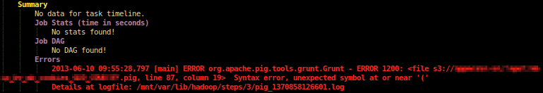

### Task timeline

A task timeline is generated via [gnuplot](http://www.gnuplot.info/) including all jobs of **in progress or past jobflow**
and giving details on number of mapper, shuffle, merge and reducer tasks.

*Animation* from generated task timelines throughout jobflow run:

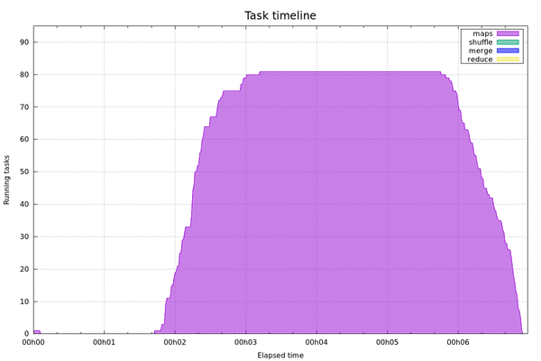

Result with a completed jobflow *(click for full resolution image)*:

[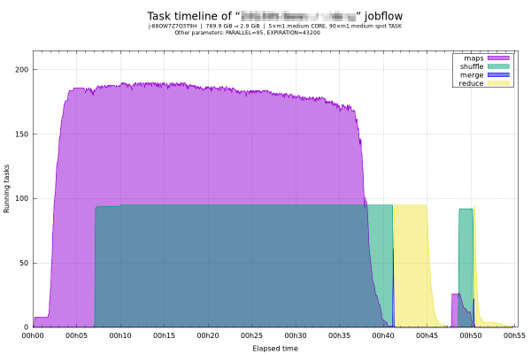](doc/images/tasktimeline.png)

## Installing

### Git clone

Create a folder, *e.g.* `/usr/local/lib/emr-monitoring`, and `cd` into it.
Then clone the repository (the folder must be empty!):

```bash
$ git clone git://github.com/Hi-Media/EmrMonitoring.git .
```

### Configuration

Initialize configuration file from `conf/config-dist.php` and adapt it:

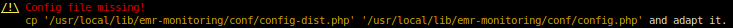

```bash
$ cp '/usr/local/lib/emr-monitoring/conf/config-dist.php' '/usr/local/lib/emr-monitoring/conf/config.php'
```

If Bash is not your default shell, then fill `$aConfig['Himedia\EMR']['shell']` whith your Bash interpreter path, *e.g.* `/bin/bash`.

### Dependencies

All dependencies are checked at launch and **EMR Monitoring** systematically helps to resolve them.

#### Composer dependencies

PHP class autoloading and PHP dependencies are managed by [composer](http://getcomposer.org).

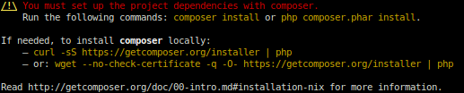

##### Text version

To set up the project dependencies with composer, run one of the following commands:

```bash
$ composer install
# or
$ php composer.phar install
```

If needed, to install composer locally, run one of the following commands:

```bash
$ curl -sS https://getcomposer.org/installer | php
# or
$ wget --no-check-certificate -q -O- https://getcomposer.org/installer | php
```

Read <http://getcomposer.org/doc/00-intro.md#installation-nix> for more information.

#### EMR CLI

[Amazon Elastic MapReduce Ruby Client](http://aws.amazon.com/developertools/2264)
is needed to get description of a jobflow.
*Warning: it requires Ruby 1.8.7 and is not compatible with later versions of Ruby.*

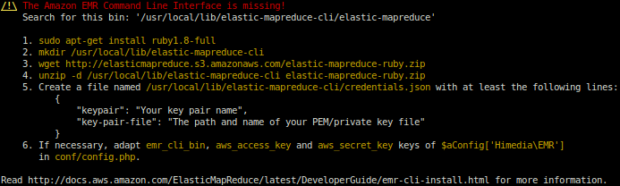

##### Text version

To install Amazon EMR Command Line Interface:

```bash
$ sudo apt-get install ruby1.8-full
$ mkdir /usr/local/lib/elastic-mapreduce-cli
$ wget http://elasticmapreduce.s3.amazonaws.com/elastic-mapreduce-ruby.zip
$ unzip -d /usr/local/lib/elastic-mapreduce-cli elastic-mapreduce-ruby.zip
```

Create a file named `/usr/local/lib/elastic-mapreduce-cli/credentials.json` with at least the following lines:

```json
{
    "keypair": "Your key pair name",
    "key-pair-file": "The path and name of your PEM/private key file"
}
```

The `key-pair-file` key is especially used to open a SSH tunnel to the master node and consult Hadoop JobTracker.

If necessary, adapt `emr_cli_bin`, `aws_access_key` and `aws_secret_key` keys
of `$aConfig['Himedia\EMR']` in `conf/config.php`.

Read <http://docs.aws.amazon.com/ElasticMapReduce/latest/DeveloperGuide/emr-cli-install.html> for more information.

#### EC2 API Tools

[Amazon EC2 API Tools](http://aws.amazon.com/developertools/351) allows to retrieve history of spots instances price.

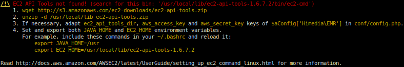

##### Text version

To install Amazon EC2 API Tools:

```bash
$ wget http://s3.amazonaws.com/ec2-downloads/ec2-api-tools.zip
$ unzip -d /usr/local/lib ec2-api-tools.zip
$ If necessary, adapt ec2_api_tools_dir, aws_access_key and aws_secret_key keys of $aConfig['Himedia\EMR'] in conf/config.php.
$ Set and export both JAVA_HOME and EC2_HOME environment variables.
```

For example, include these commands in your `~/.bashrc` and reload it:
```bash
    export JAVA_HOME=/usr
    export EC2_HOME=/usr/local/lib/ec2-api-tools-1.6.7.2
```

Read <http://docs.aws.amazon.com/AWSEC2/latest/UserGuide/setting_up_ec2_command_linux.html> for more information.

#### S3cmd

[S3cmd](http://s3tools.org/s3cmd) is required to get size of both input and output files,
to retrieve potential errors and to get log summary.

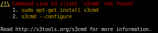

##### Text version

Please run:

```bash
$ sudo apt-get install s3cmd
$ s3cmd --configure
```

Read <http://s3tools.org/s3cmd> for more information.

#### Gnuplot

Task timelines are generated via [gnuplot](http://www.gnuplot.info/) for **in progress or past jobflow**
and give details on number of mapper, shuffle, merge and reducer tasks.

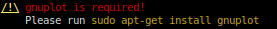

##### Text version

```bash
$ sudo apt-get install gnuplot
```

## Usage

### Command line options

You can view the options by running:

```bash
$ src/emr-monitoring.php [-h|--help]
```

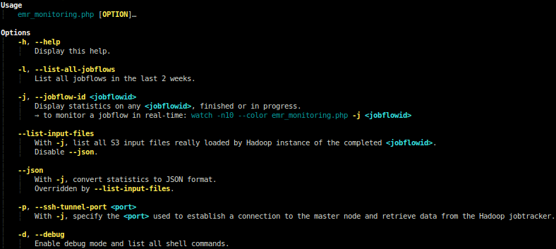

##### Text version

```
Usage
    emr_monitoring.php [OPTION]…

Options
    -h, --help
        Display this help.

    -l, --list-all-jobflows
        List all jobflows in the last 2 weeks.

    -j, --jobflow-id <jobflowid>
        Display statistics on any <jobflowid>, finished or in progress.
        ⇒ to monitor a jobflow in real-time: watch -n10 --color emr_monitoring.php -j <jobflowid>

    --list-input-files
        With -j, list all S3 input files really loaded by Hadoop instance of the completed <jobflowid>.
        Disable --json.

    --json
        With -j, convert statistics to JSON format.
        Overridden by --list-input-files.

    -p, --ssh-tunnel-port <port>
        With -j, specify the <port> used to establish a connection to the master node and retrieve data
        from the Hadoop jobtracker.

    -d, --debug
        Enable debug mode and list all shell commands.
```

### With a finished jobflow

Simply:

```bash
$ src/emr-monitoring.php -j <jobflowid>
```

### With a new jobflow

1. Launching a jobflow using Amazon Elastic MapReduce:

    ```bash
$ /usr/local/lib/elastic-mapreduce-cli/elastic-mapreduce \
    --region us-east-1 --log-uri s3n://path/to/hadoop-logs \
    --create --name my-name --visible-to-all-users --enable-debugging \
    --pig-script s3://path/to/script.pig \
    --args "-p,INPUT=s3://path/to/input" \
    --args "-p,OUTPUT=s3://path/to/output" \
    --args … \
    --instance-group master --instance-type m1.medium --instance-count 1 \
    --instance-group core --instance-type m1.medium --instance-count 5 \
    --instance-group task --instance-type m1.medium --instance-count 90 --bid-price 0.015
    ```
2. You can see it in the list of all jobflows:

    ```bash
$ src/emr-monitoring.php -l
    ```

    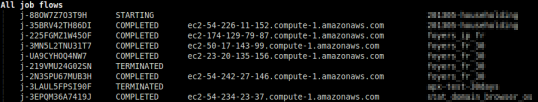

3. Start monitoring of the jobflow:

    ```bash
$ watch -n15 --color src/emr-monitoring.php -j j-88OW7Z7O3T9H
    ```

    You can easily view the task timeline with, for example, [Eye of Gnome](http://projects.gnome.org/eog/):

    ```bash
$ eog <image-path> &
    ```

## Documentation
[API documentation](http://htmlpreview.github.io/?https://github.com/Hi-Media/EmrMonitoring/blob/stable/doc/api/index.html) generated by [ApiGen](http://apigen.org/)
and included in the `doc/api` folder.

## Copyrights & licensing
Licensed under the Apache License 2.0.
See [LICENSE](LICENSE) file for details.

## ChangeLog
See [CHANGELOG](CHANGELOG.md) file for details.

## Git branching model
The git branching model used for development is the one described and assisted by `twgit` tool: [https://github.com/Twenga/twgit](https://github.com/Twenga/twgit).
